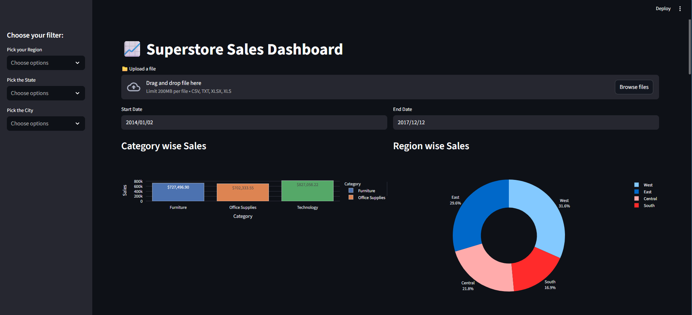
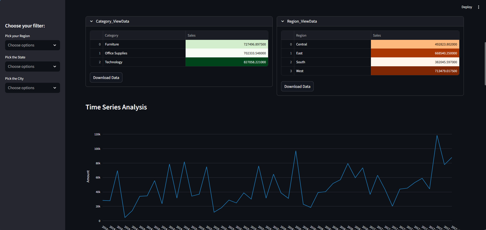
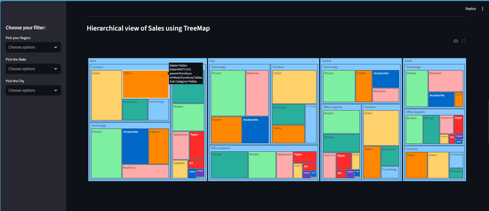

---

# 📊 Super Store Sales Analytics Dashboard

An interactive **Data Analytics & Visualization Dashboard** developed using **Python, Streamlit, and Plotly**.
This project converts raw retail sales data into **actionable business insights** through dynamic filtering and rich, interactive visualizations.

---

## 🚀 Project Overview

This dashboard performs **Exploratory Data Analysis (EDA)** on retail sales datasets (e.g., *Superstore* and *Adidas Sales*) and enables users to analyze sales performance across multiple dimensions such as:

* Time
* Region
* Product Category
* Customer Segment

The application is designed to support **data-driven decision-making** with a clean UI, responsive charts, and exportable results.

---

## ✨ Key Features

* 📂 Upload CSV or Excel files
* 📅 Date range filtering
* 🌍 Multi-level filters:

  * Region
  * State
  * City
  * Category
  * Segment
* 📊 Interactive visualizations:

  * Bar charts
  * Line charts (time series)
  * Pie charts
  * Scatter plots
  * Treemaps
  * Dual-axis charts
* ⏳ Monthly and yearly sales trend analysis
* 🌳 Hierarchical sales view (Region → Category → Sub-Category)
* 📥 Download filtered datasets as CSV
* 🎨 Responsive UI using Streamlit layouts and expanders

---

## 🛠️ Tech Stack

**Programming Language**

* Python 🐍

**Libraries & Frameworks**

* Pandas
* Streamlit
* Plotly Express
* Plotly Graph Objects
* Pillow

**Data Formats**

* CSV
* Excel

**Development Tools**

* VS Code
* Jupyter Notebook

---

## 📈 Dashboard Insights

* 📊 Sales performance by category, region, segment, and retailer
* 📅 Time-series analysis of sales trends
* 🧠 Relationship between **Sales, Profit, and Quantity**
* 🌍 Regional and city-level performance breakdown
* 📌 Business-ready visual analytics for decision-making

---
## 📸 Screenshots
<table> 
<tr>
<td></td>
<td></td>
</tr>
<tr>
<td></td>
</tr>
</table>

---

## 🎯 Use Cases

* Business Intelligence dashboards
* Sales performance analysis
* Academic and undergraduate data analytics projects
* Portfolio project for **Data Analyst / BI roles**

---

## 📬 Contact
*If you have feedback or suggestions, feel free to connect with me on [Kushan Ruwan Pathirana](www.linkedin.com/in/kushan-ruwan-pathiran) or explore my other projects on  [Kushan Ruwan Pathirana](https://github.com/KushanRuwanPathirana).
---

## ⭐ Acknowledgements

* Streamlit Documentation
* Plotly Visualization Library
* Kaggle and public retail datasets

---

## 📌 License

This project is open-source and distributed under the **MIT License**.

* Optimize this README for **recruiter visibility**
* Write a **LinkedIn project description** that matches this README
